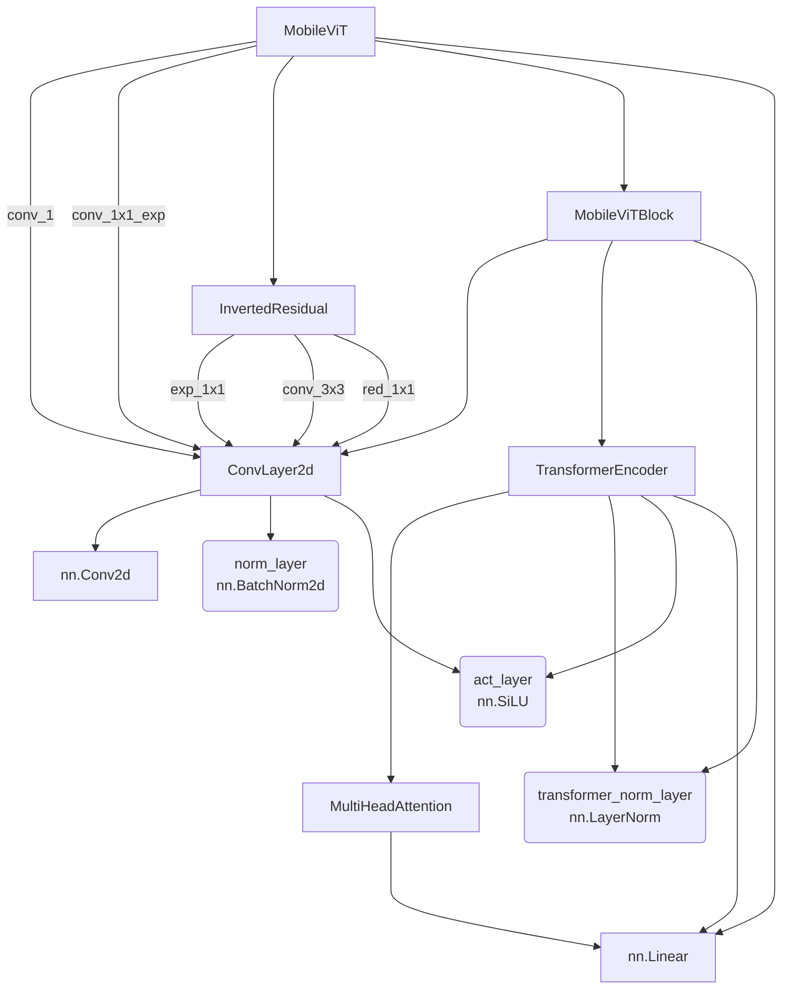

```mermaid
graph TD;
    MobileViT-- conv_1 --> ConvLayer2d;
    MobileViT-- conv_1x1_exp --> ConvLayer2d;
    MobileViT ----> InvertedResidual;
    MobileViT ----> MobileViTBlock;
    MobileViT ----> nn.Linear;

    InvertedResidual -- exp_1x1 ---> ConvLayer2d;
    InvertedResidual -- conv_3x3 ---> ConvLayer2d;
    InvertedResidual -- red_1x1 ---> ConvLayer2d;

    MobileViTBlock ----> ConvLayer2d;
    MobileViTBlock ----> TransformerEncoder;
    MobileViTBlock ----> transformer_norm_layer(transformer_norm_layer\n nn.LayerNorm);

    TransformerEncoder ----> MultiHeadAttention;
    TransformerEncoder ----> transformer_norm_layer(transformer_norm_layer\n nn.LayerNorm);
    TransformerEncoder ---> act_layer;
    TransformerEncoder ---> nn.Linear;

    MultiHeadAttention ---> nn.Linear

    ConvLayer2d --> nn.Conv2d;
    ConvLayer2d --> norm_layer(norm_layer\n nn.BatchNorm2d);
    ConvLayer2d ---> act_layer(act_layer\n nn.SiLU);
```